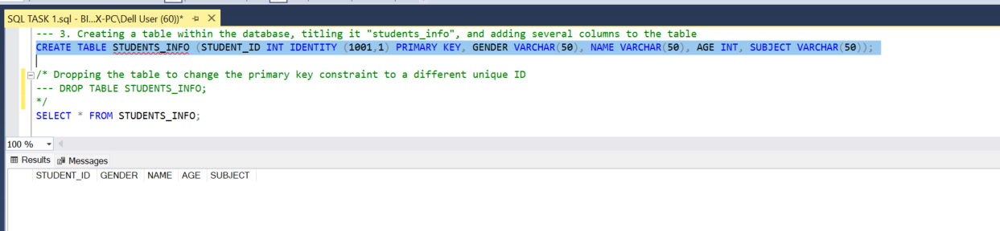
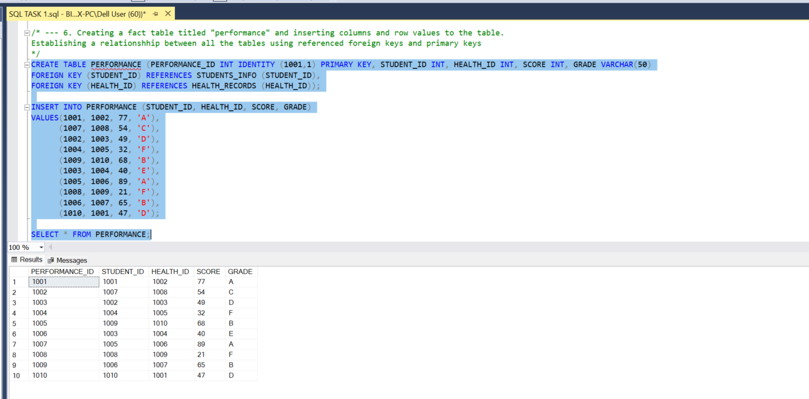

# Introduction to SQL Fundamentals: Unearthing Data Insights!
This project marks the start of my quest to master SQL fundamentals. It involved diving into database design, data retrieval, and manipulation. I refined my query-writing skills, extracting insights from complex datasets and making data-driven decisions.

_Disclaimer:_ The dataset used and reports generated do not represent any company, institution, or country. It was created by me and used to showcase my SQL skills.

Image Link -
https://particular.net/images/blog/2020/sql.jpg

## Tasks to be executed:
The following tasks are to be executed;

## Skills Demonstrated:
The following syntaxes and functions were demonstrated;

- CREATE and USE Database
- CREATE TABLE, INSERT INTO, VALUES
- SELECT, FROM, WHERE
- INT, IDENTITY, PRIMARY KEY, FOREIGN KEY, VARCHAR, DECIMAL
- DROP TABLE, DROP COLUMN
- ALTER TABLE, ALTER COLUMN
- EXEC sp_rename

## SQL Fundamentals and Analysis:

### 1. Creating and selecting the database;
- A database was created and tited it "student_records". I ensured the database created was selected.

### 2. Creating a table within the database;
- A table titled "students_info" was created and 5 columns added namely: student_id, gender, name, age, and subject.
- The student_id column was specified as a primary key for unique identification
- The SQL identity constraint was referenced with the student_id column to command SQL to automatically create the ids and exponentially increase the number by 1 in order for each id to be unique.
- The initial constraint specified for the student_id column was (1,1). I wanted to change this to (1001,1) so I dropped the table and commented the code to make it inactive, before re-running the create table syntax.
- This table is a dimension table.

### 3. Inserting row values;
- I inserted row values into the columns created to give the table a structure.

### 4. Creating another dimension table;
- Another table titled "health_records" was created and 5 columns were inserted namely: health_id, blood_group, height, and weight.
- Several constarints were specified - the identity and decimal contraints
- The initial constraint specified for the weight and height columns were (3,2). These keptbthrowing and arithmetic error, so to fix this, I increased the precision and scale to (8,2).
- I dropped the table and commented the code to make it inactive, before re-running the create table syntax.
- This table is a dimension table.

### 5. Inserting row values;
- I inserted row values into the columns created to give the table a structure.

### 6. Creating a fact table;
- A fact table titled "performance" was created.
- I inserted the following columns: performance_id, student_id, health_id, score, and grade.
- To establish a relationshhip between all the tables, I referenced the student_id and health_id from the student_info and health_records tables as foreign keys.
- Row values were inserted to the columns. 
- I selected the table to have a view of what was created.

### 7. Viewing all tables;
- I selected all 3 tables to have a view of all of them at a glance.

### 8. Adding Constraints; 
- To prevent the student_ID and subject columns from taking null values, I added constraints.
- I altered the table and specified the NOT NULL condition for both columns.

### 9. Renaming columns;
- The column name "subject" was renamed to "Course" using the EXEC sp_rename syntax as seen in the image below.

### 10. Copy of the student_info table;
- I made a copy of the student_info table and duplicated all the data from the original table into it before altering/deleting any column.

### 11. Dropping a column;
- The 'Age' Column from the student_info table was deleted.

## Appraisal;

My SQL journey has been an exciting exploration of the data world. I've acquired a strong foundation in SQL fundamentals, from database design to data retrieval and manipulation. While I've honed my query-writing skills and can extract insights from complex datasets, I recognize there's much more to learn. I'm eager to delve deeper into advanced SQL techniques, optimize performance, and tackle more complex projects. With each new challenge, I aim to enhance my SQL expertise and make more informed, data-driven decisions. The journey has just begun, and I'm committed to continuous improvement in the world of SQL.

THANK YOU!!! 🥇
